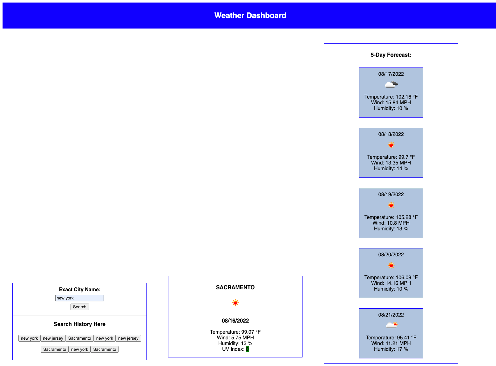

# Server-Side-APIs-Weather-Dashboard

## User Story

```md
AS A coding student
I WANT to learn how to fetch free data from other URLs with a free API key, in this instance, specifically, Open Weather API
SO THAT I can display Open Weather API data in my own site and store search history to return to
```

## Acceptance Criteria

```md
GIVEN a simple input field
WHEN I insert an exact city name
THEN I am able to browse its current weather followed by its 5-day forecast 
WHEN I view information like temperature, the humidity, the wind speed, and the UV index
THEN the UV index changes color depending on the condition
WHEN I view the search history
THEN I can click on any of the past buttons to see their current condition followed by 5-day forecast
```

## Screenshot

 1. Before clicking search
    
 1. Adding another search
    
 3. Going back to one of the searches from current search
    

  ## URL
  * https://github.com/leanonruthie/Weather-Dashboard.git
  * https://leanonruthie.github.io/Weather-Dashboard/
